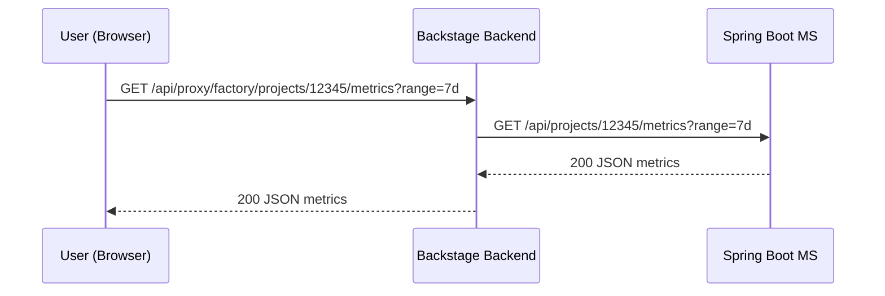

# # Factory Metrics MS

## Endpoint

- `GET /api/projects/{projectId}/metrics?range=7d`

## Flux (Backstage -> Proxy -> Spring)



## Exemple de réponse

```json
{"projectId":"12345","rows":[{"bucket_day":"2025-12-16","metric_key":"pipeline_duration_sec_p50","value":310.0,"unit":"s"}]}
```
ça me soule....
